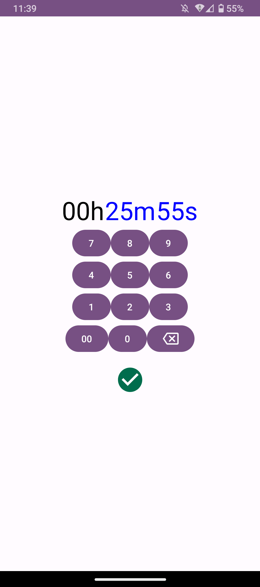
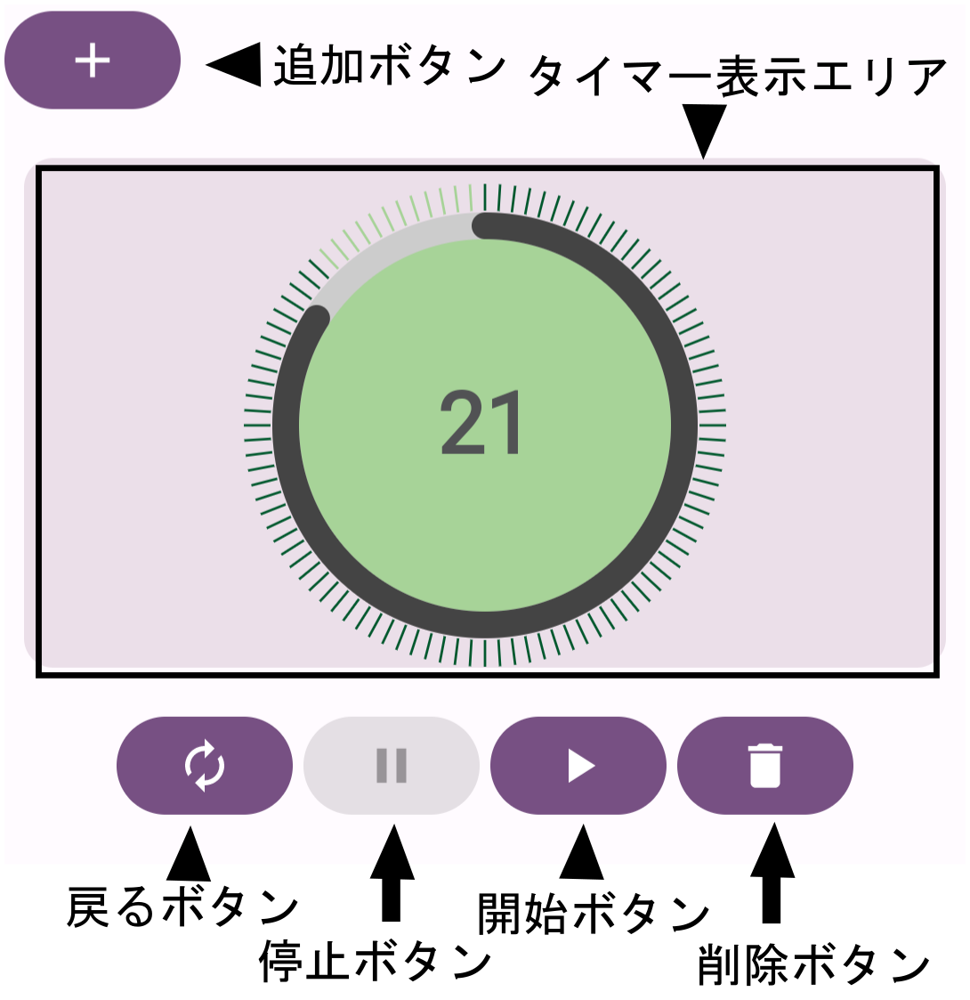

# android-compose-simple-timer(最小限の実装)
JetpackComposeを利用して作成したシンプルなタイマーアプリ

>[!CAUTION]
>このコードは不完全です。  
>・タイマーをストップしたのにタイマーが裏で継続されてしまっています。  
>・タイマーの目盛りの表示がずれています。  
>・ダークモードに対応していません。

## 想定環境
使用言語: Kotlin  
Android Studio Giraffe | 2022.3.1  
OS: Windows 11  
minSdkVersion: 26  
targetSdkVersion: 33 

## アプリのメイン画面


## 遷移先
↓タイマーの追加画面  


↓タイマーの通知画面  


## 利用手順
  

### タイマーを追加する
1. 追加ボタンをタップします。
2. 遷移先のタイマーの追加画面でタイマーの時間を設定します。
3. 数字ボタンの下のチェックボタンをタップして確定します。
5. アプリのメイン画面にタイマーが追加されています。
### タイマーを操作する
1. 開始ボタンをタップしてタイマーを開始します。
2. 停止ボタンをタップしてタイマーを停止します。
3. 戻るボタンをタップしてタイマーを元の秒数に戻します。
4. 削除ボタンをタップしてタイマーを削除します。
5. タイマーの秒数が0になるとタイマーの通知画面が表示され振動します。
6. タイマーの通知画面で停止ボタンをタップするとアプリのメイン画面に戻ります。

## 使用ライブラリ
不要なライブラリを追加している可能性があります。
### Navigation
```
dependencies {
    implementation "androidx.navigation:navigation-fragment-ktx:2.5.3"
    implementation "androidx.navigation:navigation-ui-ktx:2.5.3"
    implementation "androidx.navigation:navigation-compose:2.5.3"
}
```
### ViewModel
```
dependencies {
    implementation "androidx.lifecycle:lifecycle-viewmodel-compose:2.5.1"
    implementation "androidx.lifecycle:lifecycle-viewmodel-ktx:2.5.1"
    implementation "androidx.lifecycle:lifecycle-viewmodel-savedstate:2.5.1"
}
```
### Room
```
plugins {
    id 'com.google.devtools.ksp' version "1.8.21-1.0.11"
}
dependencies {
    implementation "androidx.room:room-runtime:2.5.0"
    annotationProcessor "androidx.room:room-compiler:2.5.0"
    ksp "androidx.room:room-compiler:2.5.0"
    implementation "androidx.room:room-ktx:2.5.0"
}
```

## 使用権限
AlarmManagerがアプリを閉じているときに作動しないことが起こっており、それを解消するために様々な権限の付与を試みています。`android.permission.VIBRATE`は通知の際に振動で知らせるための権限です。
```xml
<uses-permission android:name="android.permission.USE_EXACT_ALARM" />
<uses-permission android:name="android.permission.SCHEDULE_EXACT_ALARM" />
<uses-permission android:name="android.permission.VIBRATE" />
<uses-permission android:name="android.permission.REQUEST_IGNORE_BATTERY_OPTIMIZATIONS"/>
```

